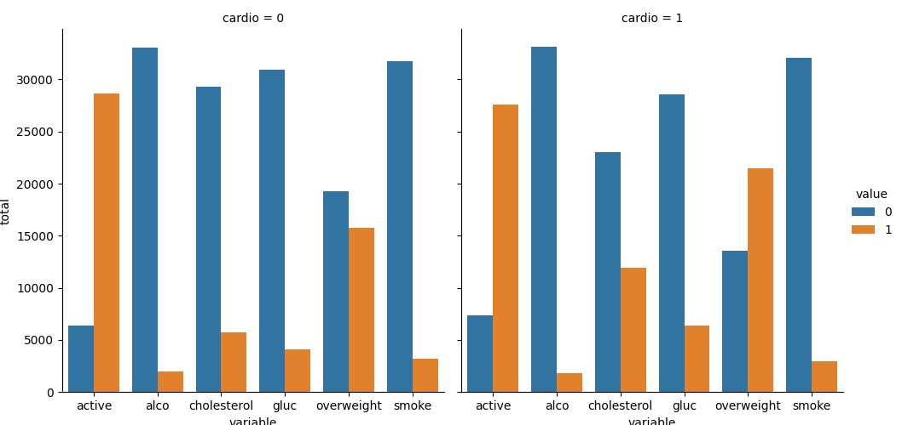
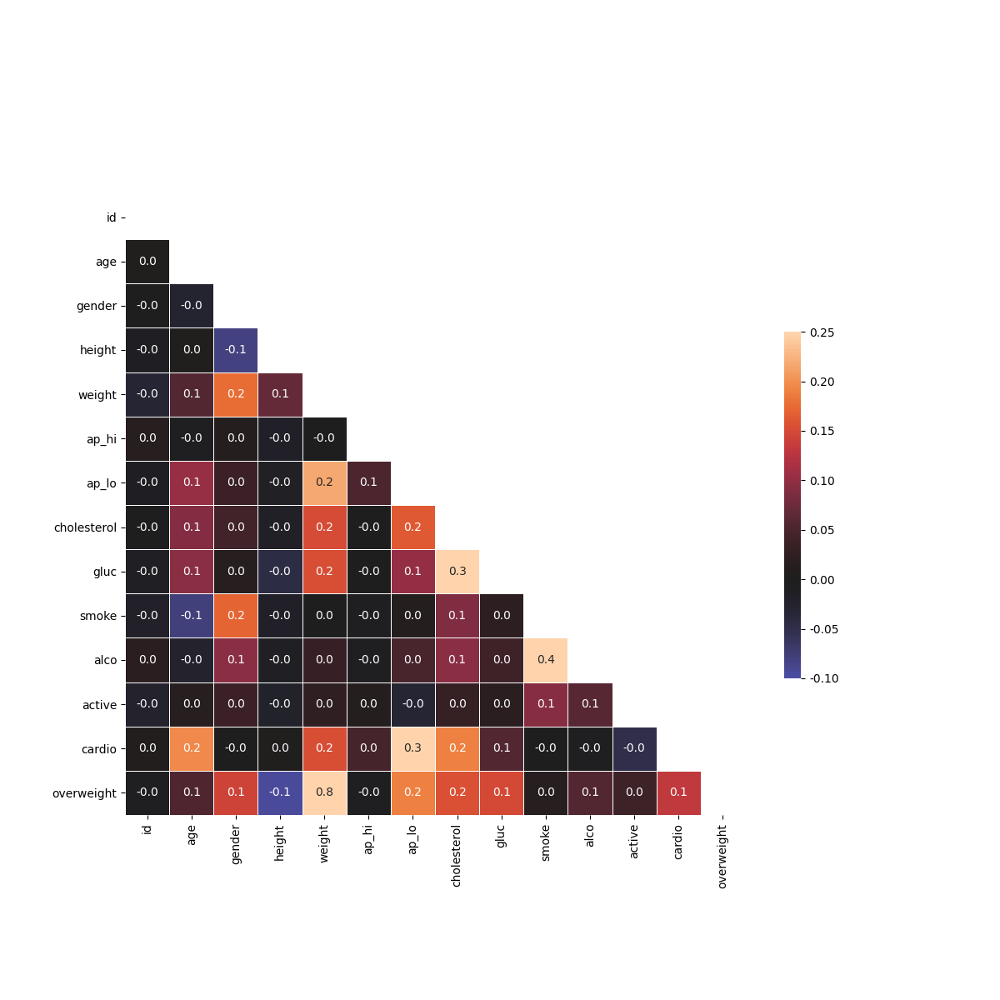
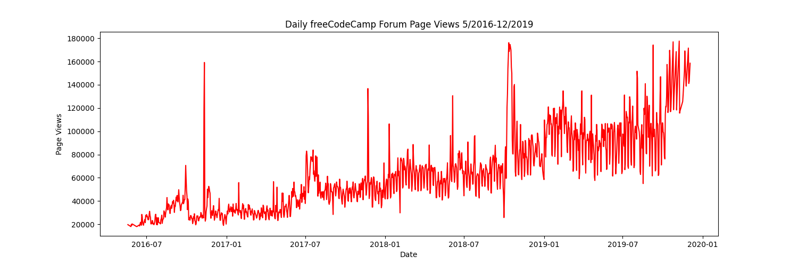
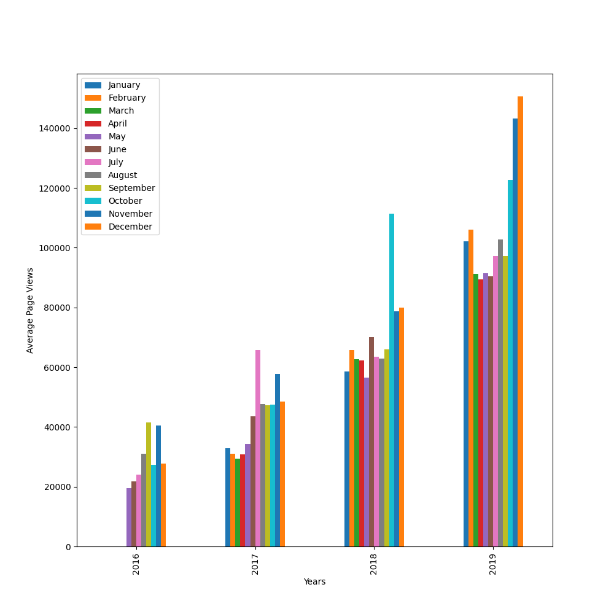
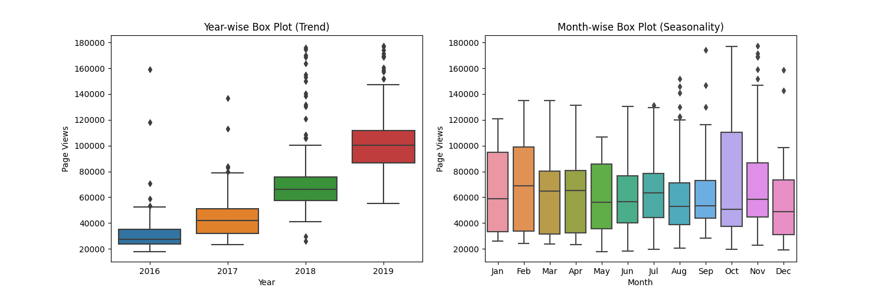
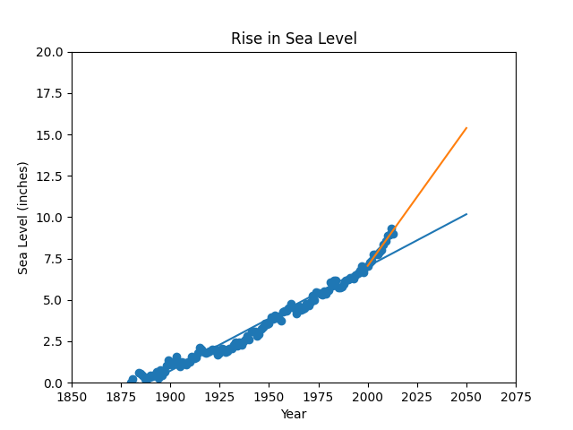

# Data Analysis with Python - Projects

These projects are part of the "Data Analysis with Python" curriculum on FreeCodeCamp. Descriptions of the projects and examples are taken from 
https://www.freecodecamp.org/learn/data-analysis-with-python/data-analysis-with-python-projects

## Project 1 : Mean-Variance-Standard Deviation Calculator ✏️

The aim is to create a function named ```calculate()``` that uses Numpy to output the mean, variance, standard deviation, max, min, and sum of the rows, columns, and elements in a 3 x 3 matrix.

The input of the function must be a list containing 9 digits. The function should convert the list into a 3 x 3 Numpy array, and then return a dictionary containing the mean, variance, standard deviation, max, min, and sum along both axes and for the flattened matrix.

### Example:

Input:
```
calculate([0,1,2,3,4,5,6,7,8])
```
Output:
```
{
  'mean': [[3.0, 4.0, 5.0], [1.0, 4.0, 7.0], 4.0],
  'variance': [[6.0, 6.0, 6.0], [0.6666666666666666, 0.6666666666666666, 0.6666666666666666], 6.666666666666667],
  'standard deviation': [[2.449489742783178, 2.449489742783178, 2.449489742783178], [0.816496580927726, 0.816496580927726, 0.816496580927726], 2.581988897471611],
  'max': [[6, 7, 8], [2, 5, 8], 8],
  'min': [[0, 1, 2], [0, 3, 6], 0],
  'sum': [[9, 12, 15], [3, 12, 21], 36]
}
```

## Project 2 : Demographic Data Analyzer 🌎

The project consists in analyzing demographic data using Pandas. The dataset of demographic data  was extracted from the 1994 Census database. 
In particular the project aims at knowing:
- How many people of each race are represented in this dataset?
- What is the average age of men?
- What is the percentage of people who have a Bachelor's degree?
- What percentage of people with advanced education (Bachelors, Masters, or Doctorate) make more than 50K?
- What percentage of people without advanced education make more than 50K?
- What is the minimum number of hours a person works per week?
- What percentage of the people who work the minimum number of hours per week have a salary of more than 50K?
- What country has the highest percentage of people that earn >50K and what is that percentage?
- What is the most popular occupation for those who earn >50K in India?

## Project 3 : Medical Data Visualizer :stethoscope:

The project aims at visualizing and making calculations from medical examination data using matplotlib, seaborn, and pandas. The dataset values were collected during medical examinations. The rows in the dataset represent patients and the columns represent information like body measurements, results from various blood tests, and lifestyle choices.The goal is to use the dataset to explore the relationship between cardiac disease, body measurements, blood markers, and lifestyle choices.

In the project:
- I create a chart where I show the counts of good and bad outcomes for the cholesterol, gluc, alco, active, and smoke variables for patients with cardio=1 and cardio=0 in different panels.
- I add an overweight column to the data. To determine if a person is overweight, I their BMI by dividing their weight in kilograms by the square of their height in meters. If that value is > 25 then the person is overweight. The value 0 is used for NOT overweight and the value 1 for overweight.
- I normalize the data by making 0 always good and 1 always bad. If the value of cholesterol or gluc is 1, the value becomes 0. If the value is more than 1, it becomes 1.
- I convert the data into long format and create a chart that shows the value counts of the categorical features using seaborn's catplot().

- I clean the data, filtering out the following patient segments that represent incorrect data:
    - diastolic pressure is higher than systolic
    - height is less than the 2.5th percentile
    - height is more than the 97.5th percentile
    - weight is less than the 2.5th percentile
    - weight is more than the 97.5th percentile
    - Finally, I create a correlation matrix using the dataset. 


## Project 4 : Page View Time Series Visualizer :telescope:

This project visualizes a dataset containing the number of page views each day on the freeCodeCamp.org forum from 2016-05-09 to 2019-12-03. The data visualizations realized using Pandas, Matplotlib, and Seaborn highlight the patterns in visits and identify yearly and monthly growth.

More in detail:
- I clean the data by filtering out days when the page views were in the top 2.5% of the dataset or bottom 2.5% of the dataset.
- Create a ```draw_line_plot``` function that uses Matplotlib to draw a line chart displaying "Page Views" as a function of "Date".

- Create a ```draw_bar_plot``` function that draws a bar chart showing the average daily page views for each month grouped by year.
 
- Create a ```draw_box_plot``` function that uses Seaborn to draw two adjacent box plots showing how the values are distributed within a given year or month and how it compares over time.


## Project 5 : Sea Level Predictor 🌊

In this project I snalyze a dataset of the global average sea level change since 1880 and use the data to predict the sea level change through year 2050.

More in detail:
- I use matplotlib to create a scatter plot using the "Year" column as the x-axis and the "CSIRO Adjusted Sea Level" column as the y-axix.
- I use the ```linregress``` function from scipy.stats to get the slope and y-intercept of the line of best fit and plot the line of best fit over the top of the scatter plot.
- I plot a new line of best fit just using the data from year 2000 through the most recent year in the dataset and make the line also go through the year 2050 to predict the sea level rise in 2050 if the rate of rise continues as it has since the year 2000.

